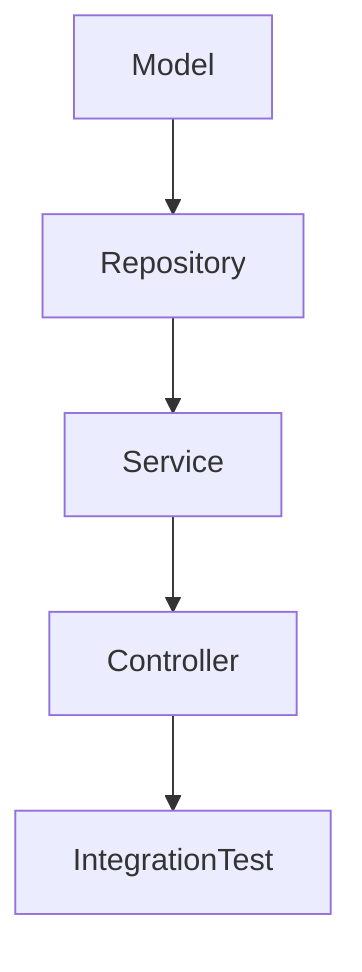

# Desenvolvimento de Webservices em Java com TDD

## 1. Introdução
Test-Driven Development (TDD) é uma abordagem de desenvolvimento onde os testes são escritos antes da implementação do código. Isso garante que o software seja desenvolvido com qualidade, cobertura de testes adequada e redução de bugs.

Este documento aborda o desenvolvimento de um webservice em **Java** utilizando **Spring Boot** e **JUnit 5**, seguindo os princípios do TDD. Serão apresentados exemplos práticos da hierarquia de testes, desde **models** até **repositories**, **services**, **controllers**, e boas práticas para otimização de testes quando o prazo é curto.

## 2. Objetivo
O objetivo deste documento é fornecer um guia prático para a aplicação de TDD no desenvolvimento de um webservice em Java, garantindo testes eficazes e entendendo quais são essenciais e quais podem ser omitidos em cenários de prazo reduzido.

## 3. Público-alvo
- Desenvolvedores Java
- Arquitetos de Software
- Engenheiros de Qualidade de Software (QA)
- Equipes de DevOps
- Interessados em boas práticas de desenvolvimento

## 4. Hierarquia dos Testes
A estrutura de testes segue uma hierarquia clara para garantir a cobertura de todas as camadas do sistema:



Cada camada tem um conjunto de testes específico, descrito a seguir:

### 4.1. Model Tests
Os testes de modelo verificam se as entidades possuem os atributos corretos, validações e comportamento esperado.

**Exemplo:**
```java
import static org.assertj.core.api.Assertions.assertThat;
import org.junit.jupiter.api.Test;

class UserTest {
    @Test
    void shouldCreateUser() {
        User user = new User("John Doe", "john.doe@example.com");
        assertThat(user.getName()).isEqualTo("John Doe");
        assertThat(user.getEmail()).isEqualTo("john.doe@example.com");
    }
}
```

### 4.2. Repository Tests
Os testes de repositório garantem que a interação com o banco de dados funciona corretamente.

**Exemplo:**
```java
import static org.assertj.core.api.Assertions.assertThat;
import org.junit.jupiter.api.Test;
import org.springframework.beans.factory.annotation.Autowired;
import org.springframework.boot.test.autoconfigure.orm.jpa.DataJpaTest;

@DataJpaTest
class UserRepositoryTest {

    @Autowired
    private UserRepository userRepository;

    @Test
    void shouldSaveAndFindUser() {
        User user = new User("Jane Doe", "jane.doe@example.com");
        userRepository.save(user);
        User foundUser = userRepository.findByEmail("jane.doe@example.com");
        assertThat(foundUser).isNotNull();
        assertThat(foundUser.getName()).isEqualTo("Jane Doe");
    }
}
```

### 4.3. Service Tests
Os testes de serviço validam a lógica de negócio sem depender de infraestrutura externa.

**Exemplo:**
```java
import static org.mockito.Mockito.*;
import static org.assertj.core.api.Assertions.*;
import org.junit.jupiter.api.Test;
import org.mockito.InjectMocks;
import org.mockito.Mock;
import org.mockito.junit.jupiter.MockitoExtension;
import org.junit.jupiter.api.extension.ExtendWith;

@ExtendWith(MockitoExtension.class)
class UserServiceTest {

    @Mock
    private UserRepository userRepository;

    @InjectMocks
    private UserService userService;

    @Test
    void shouldReturnUserWhenEmailExists() {
        User user = new User("Alice", "alice@example.com");
        when(userRepository.findByEmail("alice@example.com")).thenReturn(user);
        
        User foundUser = userService.getUserByEmail("alice@example.com");
        assertThat(foundUser).isNotNull();
        assertThat(foundUser.getName()).isEqualTo("Alice");
    }
}
```

### 4.4. Controller Tests
Os testes de controlador garantem que a API responde corretamente a diferentes solicitações.

**Exemplo:**
```java
import static org.springframework.test.web.servlet.request.MockMvcRequestBuilders.get;
import static org.springframework.test.web.servlet.result.MockMvcResultMatchers.*;
import org.junit.jupiter.api.Test;
import org.springframework.beans.factory.annotation.Autowired;
import org.springframework.boot.test.autoconfigure.web.servlet.WebMvcTest;
import org.springframework.test.web.servlet.MockMvc;

@WebMvcTest(UserController.class)
class UserControllerTest {

    @Autowired
    private MockMvc mockMvc;

    @Test
    void shouldReturnUserByEmail() throws Exception {
        mockMvc.perform(get("/users/email?email=john.doe@example.com"))
                .andExpect(status().isOk());
    }
}
```

### 4.5. Integration Tests
Testes de integração garantem que os componentes funcionam corretamente em conjunto.

**Exemplo:**
```java
import org.junit.jupiter.api.Test;
import org.springframework.boot.test.context.SpringBootTest;

@SpringBootTest
class ApplicationTests {
    @Test
    void contextLoads() {
    }
}
```

## 5. Testes Essenciais vs. Opcionais em Prazos Curtos
### Testes Essenciais
1. **Service Tests**: Validam a lógica de negócio, evitando erros críticos.
2. **Repository Tests**: Garantem que os acessos ao banco de dados funcionam corretamente.
3. **Controller Tests**: Validam que a API responde conforme esperado.

### Testes Opcionais em Prazos Curtos
1. **Model Tests**: Podem ser omitidos se as entidades forem simples.
2. **Integration Tests**: Custosos e demorados; podem ser reduzidos se as demais camadas estiverem bem testadas.
3. **UI Tests (se aplicável)**: Testes end-to-end (E2E) podem ser deixados para momentos de maior disponibilidade.

!!! tip "Dica"
    Utilize mocks para testes mais rápidos e independentes.

## 6. Referências
- [Spring Boot Documentation](https://spring.io/projects/spring-boot)
- [JUnit 5 Documentation](https://junit.org/junit5/)
- [Mockito Documentation](https://site.mockito.org/)

